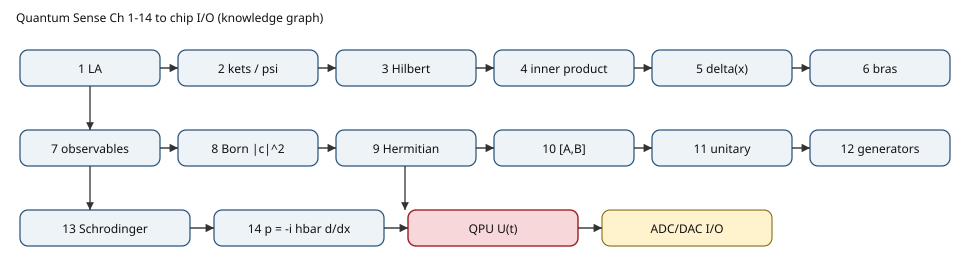

# From Hilbert Space to Display

A 10-page knowledge graph of [Quantum Sense](https://www.youtube.com/@quantumsensechannel)
[*Maths of Quantum Mechanics*](https://www.youtube.com/playlist?list=PL8ER5-vAoiHAWm1UcZsiauUGPlJChgNXC)
(Ch. 1–14, ~3 h, Brandon Sandoval, Stanford → Caltech), mapped onto one research question:

> **How can a quantum-computing chip take an input and produce a displayable output?
> Where, exactly, is the quantum processor in the path from sensor to screen?**

The playlist is the *math* of single-particle QM. It does **not** teach chips, QFT, 5G,
GPS, consciousness, or entanglement. Those bridges are labeled as synthesis so the two
layers stay distinct.

---

## Direct answer

The QPU is **not** on the pixel bus. It is an isolated analog Hilbert-space coprocessor.
Every sensor, radio, kernel, router, and display stays classical.

```
world → CMOS / LiDAR / IMU / RF → ADC → host CPU/GPU/FPGA
      → DAC + IQ pulses (4–10 GHz)
      → [ QPU : |ψ⟩ ↦ U(t)|ψ⟩ = exp(−iHt/ℏ)|ψ⟩ ]
      → readout resonator → ADC → bits → GPU framebuffer → display
```

Only the bracket is quantum. Superposition is **one vector** `α|0⟩+β|1⟩`, not two voltages
on one wire. A measurement returns **one** bit, with Born frequencies `|α|²`, `|β|²`.
`|ψ(x)|²` is that rule in a continuous basis — a probability density, not a signal you
pipe to a screen.

**Transistor → qubit is not a drop-in swap.** A FET is a dissipative voltage-controlled
latch at 300 K. A qubit is a coherent two-level mode (~10 mK transmon, spin in Si/SiGe,
ion, photon). Cryo-CMOS control ASICs are still transistors sitting *next to* the QPU,
not *as* the QPU.

---

## Watch the source series

| Ch | Video | min |
|---:|---|---:|
| 1 | [Why linear algebra?](https://www.youtube.com/watch?v=3nvbBEzfmE8) | 11:18 |
| 2 | [What are kets and wavefunctions?](https://www.youtube.com/watch?v=DBZ_hCmj8Mk) | 12:12 |
| 3 | [Why do we need a Hilbert Space?](https://www.youtube.com/watch?v=_kJUUxjJ_FY) | 8:12 |
| 4 | [What is an inner product?](https://www.youtube.com/watch?v=3N2vN76E-QA) | 10:11 |
| 5 | [Dirac deltas and wavefunction inner products](https://www.youtube.com/watch?v=nDa3cqFk80o) | 10:31 |
| 6 | [Bras and bra-ket notation](https://www.youtube.com/watch?v=lRR-qgjaKlg) | 10:03 |
| 7 | [How are observables operators?](https://www.youtube.com/watch?v=ANLRQ7X6h5A) | 10:28 |
| 8 | [Why is probability equal to amplitude squared?](https://www.youtube.com/watch?v=PZUZgOUOOIU) | 23:05 |
| 9 | [What are Hermitian operators?](https://www.youtube.com/watch?v=da1rH0Hq62Q) | 11:10 |
| 10 | [Commutator and the uncertainty principle](https://www.youtube.com/watch?v=-pRk9HNh7os) | 17:26 |
| 11 | [What are unitary operators?](https://www.youtube.com/watch?v=dD-oYfhSKhg) | 6:35 |
| 12 | [Generators in classical mechanics](https://www.youtube.com/watch?v=lJorwy0BQGU) | 14:17 |
| 13 | [Where does the Schrödinger equation come from?](https://www.youtube.com/watch?v=KmFG_QNSZzA) | 14:58 |
| 14 | [Where does the momentum operator come from?](https://www.youtube.com/watch?v=A7yDvA8VQC8) | 17:43 |

Playlist: https://www.youtube.com/playlist?list=PL8ER5-vAoiHAWm1UcZsiauUGPlJChgNXC

YouTube videos cannot be copied into this repository (copyright). Watch them on the
channel. This repo is a compressed knowledge graph + hardware map, not a transcript dump.

---

## Knowledge graph

```mermaid
flowchart LR
  C1[Ch1 why LA] --> C2[Ch2 kets / psi]
  C2 --> C3[Ch3 Hilbert]
  C3 --> C4[Ch4 inner product]
  C4 --> C5[Ch5 Dirac delta]
  C5 --> C6[Ch6 bras]
  C6 --> C7[Ch7 observables]
  C7 --> C8[Ch8 Born rule]
  C8 --> C9[Ch9 Hermitian]
  C9 --> C10[Ch10 commutator]
  C10 --> C11[Ch11 unitary]
  C11 --> C12[Ch12 generators]
  C12 --> C13[Ch13 Schrodinger]
  C13 --> C14[Ch14 p = -i hbar d/dx]
  C8 --> QPU[QPU sandwich]
  C11 --> QPU
  C14 --> QPU
  QPU --> DISP[classical display]
```





---

## Input → display pipeline


ASCII version (also in `diagrams/terminal.md`):

```
 WORLD ──ADC── HOST ──DAC/μw── [ QPU |ψ⟩→U(t)|ψ⟩ ] ──readout──ADC── HOST ──DISPLAY
 classical                         ONLY THIS BOX                 classical
```

---

## Scientific diagrams

| file | what it is |
|---|---|
| `diagrams/knowledge_graph.svg` | Ch.1–14 graph with bridge edges into the QPU |
| `diagrams/io_pipeline.svg` | sensor → QPU island → display |
| `diagrams/transistor_vs_qubit.svg` | CMOS FET vs coherent two-level system |
| `diagrams/wavefunction_born.svg` | ψ(x) vs \\|ψ(x)\\|² — density, not a voltage |
| `diagrams/terminal.md` | fridge floorplan, generator family, Born pipeline in a terminal |

Regenerate animated GIFs locally:

```bash
python scripts/generate_gifs.py
# writes assets/gifs/bloch_precession.gif
#         assets/gifs/born_sampling.gif
```

The Bloch GIF is a state vector moving on S². The Born GIF is repeated σ_z shots
converging to `|c|²`. Together they are the picture of “you do not stream 0 and 1
at once.”

---

## What the 14 videos actually build

| Ch | Claim | Chip translation |
|---|---|---|
| 1–3 | Discrete random spectra force vectors in a complete Hilbert space H | n qubits live in (C²)^⊗n |
| 4–6 | Overlap ⟨φ\ψ⟩, δ, bras, Σ\\|i⟩⟨i\\| = I | amplitudes / fidelity, not pin voltages |
| 7–9 | Observables = Hermitian operators; Born P=\\|c\\|² | σ_z readout; shot histogram |
| 10–11 | [A,B]≠0 ⇒ no joint sharp values; gates are unitary | cannot copy \\|ψ⟩ onto a wire; decoherence = unitarity failing |
| 12–14 | Energy generates time, momentum generates space | pulses implement H(t); p=-iℏ∂x |

Ch.8 in the videos is a *consistency / DE argument* for `|c|²`, not a full Gleason
proof. Gleason is the rigorous uniqueness theorem for dim ≥ 3. Ch.12 is a heuristic
Lagrangian-generator sketch, not a full symplectic / Noether treatment.

---

## Transistor vs qubit


- CMOS stays as the **control plane** (compiler, DAC, cryo-CMOS at 4 K, discriminator).
- The **QPU** is the isolated coherent mode: Josephson junction + capacitor (transmon),
  electron spin in a Si/SiGe or GaAs dot, trapped ion, or photonic dual-rail.
- A phone already rides quantized EM fields (Bluetooth / Wi-Fi / 5G = Maxwell /
  coherent states of the U(1) photon field at huge occupation number). GPS *clocks*
  are quantum (Cs/Rb hyperfine). IMU fusion and the display compositor are not.

---

## Wavefunction and the PDF


Classical PDF: ensemble frequency. Quantum `|ψ(x)|²`: Born density of a *single-shot*
position measurement. On a chip the density lives only inside H until readout
collapses it to bits.

---

## Compile the 10-page paper

```bash
# Overleaf: new project → upload paper/QuantumSense_HilbertSpace_to_Display.tex
# Local:
pdflatex -interaction=nonstopmode paper/QuantumSense_HilbertSpace_to_Display.tex
```

Needed packages: `amsmath amssymb braket tikz tikz-cd circuitikz quantikz tcolorbox
enumitem booktabs tabularx fancyhdr titlesec setspace needspace graphicx xcolor hyperref`.

A compiled PDF is not stored in this repo (binary push is unreliable through the
connected GitHub API). Compile it.

---

## Mapping onto a CS / SciML background

| Your stack | Quantum analog in this document |
|---|---|
| bits / floats | amplitudes in H, then Born samples |
| DFS / BFS / A* | classical search on a graph; Grover is amplitude amplification, not a drop-in |
| transformer / CNN | stay on GPU for pixels; QPU is a batch interferometer |
| ADC / DAC | the *only* legal bridge between voltages and Hilbert space |
| IMU / LiDAR / CV | classical transducers + classical pipelines |
| SciML / PINNs | Schrödinger PDE is one more residual; it does not put the trainer in superposition |

Where a QPU actually rises: the computational primitive is interference in
`(C²)^⊗n` (period finding, some chemistry / VQE, certain kernels). Readout still
returns only `n` bits per shot, not `2^n`.

---

## Honest gaps

- The series never covers entanglement. Entanglement is a tensor-product correlation
  in `H_A ⊗ H_B`, not a theory of mind.
- Consciousness is out of scope.
- We do not copy YouTube video files or transcripts into this repository.

## License / source

Video explanations © Brandon Sandoval / Quantum Sense. This repository is an
independent compressed map + hardware synthesis, not a replacement for the lectures.
